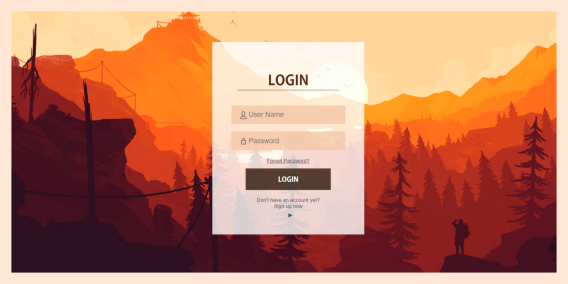
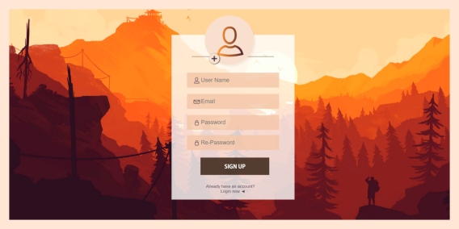
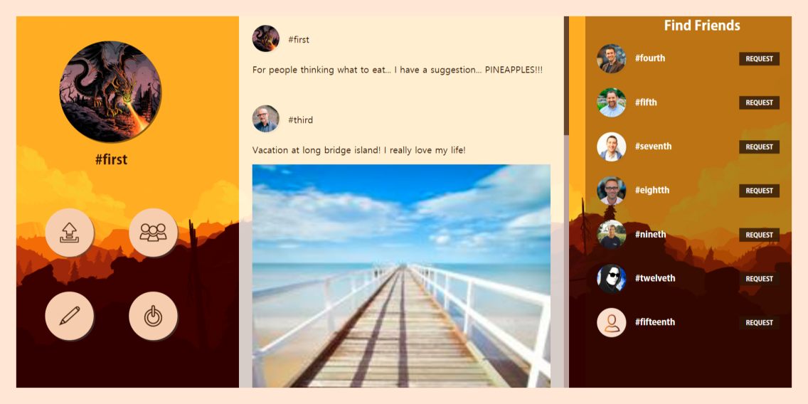
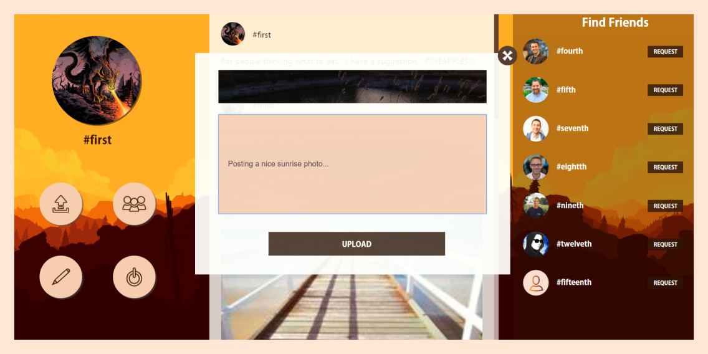

# Social Network Web Application
This is part of my course project for the course of Database Management Systems. After learning primary SQL syntax and using MySQL, this project is an attempt to build a social networking web application with PHP. The project includes login page along with a home page running dynamically from MySQL Local Server. 

  

  

  

  

# Dependencies
The only required software you require for running the project is:
- XAMPP MySQL

# How to Setup on new System
Make sure the system has all dependencies required in the project installed
- Run XAMPP and Start the Apache and MySQL servers.
- Open your favourite web browser and type localhost and click phpMyAdmin to top right
- Create a new database called 'social-network'.
- To import the schema in the database:
  - Open the Database in phpMyAdmin.
  - Click on the Databases from the top menu.
  - Select the name of the database from the drop-down menu which you want to import.
  - Click on the Import tab.
  - Browse for a file named social-network.sql.zip included in this project and then click on the ‘Go’ button at the bottom.
- Once the system has the functioning database copy this project folder in xampp/htdoc
- From your browser type localhost/<name of folder of this project>/index.php
  
# Browsing The Web Application
Once the phpMyAdmin is setup with your database, and you can acess the index.php, you can browse diffrent functionalities provided by this Web Application including:
- Login and Signup (The database included has some sample accounts names first, second.. with passwords same as names)
- Browse through upload feed based on accounts you follow
- Request to follow accounts
- Accept requests from other accounts to follow
- Change profile image, email id, user name, password
- Upload images/text or both on your feed
- Log out
